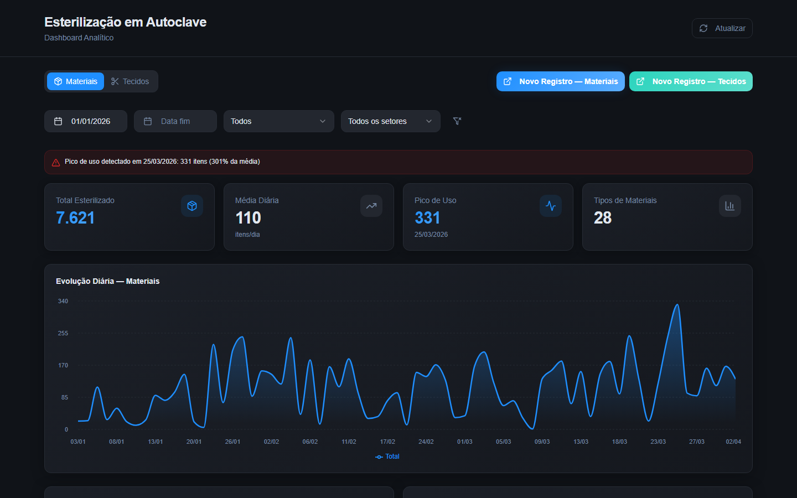
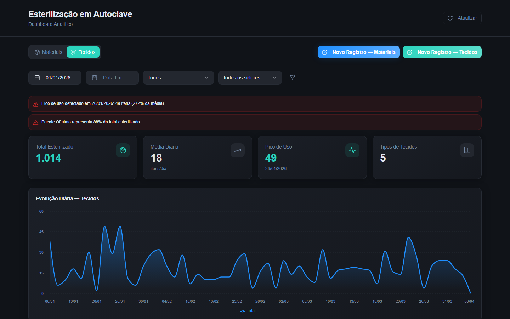

<div align="center">
  <h1>🏥 Dashboard: Esterilização em Autoclave</h1>
  <p>
    <b>Dashboard Analítico interativo para gestão e auditoria da Central de Materiais e Esterilização (CME)</b>
  </p>
  
  [](https://reactjs.org/)
  [](https://www.typescriptlang.org/)
  [](https://tailwindcss.com/)
  [](https://vitejs.dev/)
</div>

<br/>



---

## 📋 Visão Geral

Este projeto foi desenvolvido como uma solução de **modernização de controles internos** voltada para a área clínica. Ele provê monitoramento analítico, interativo e em tempo real para a área de auditoria do SCIH (Serviço de Controle de Infecção Hospitalar), gerenciando de forma eficiente o fluxo de materiais e tecidos em todos os setores hospitalares.

## ✨ Recursos Principais

- 📊 **Métricas e KPIs Dinâmicos:** Cálculo de totais, médias diárias e detecção automática de picos de uso.
- 📈 **Visualização Premium de Dados:** Gráficos interativos utilizando `Recharts` (Timeline, Donut, Bar).
- 🔄 **Sincronização em Tempo Real:** Integração contínua com banco de dados baseados em Planilhas.
- 🎨 **Design White-Label e Responsivo:** UI sofisticada construída com componentes do `shadcn/ui` e utilitários modernos do `Tailwind CSS`.
- 🔍 **Filtros Avançados:** Segmentação profunda por períodos (datas), tipos de materiais e setores específicos do hospital.

<br/>

## 🛠️ Tecnologias e Ferramentas

| Categoria | Tecnologia |
| -- | -- |
| **Framework/Core** | React, TypeScript, Vite |
| **Estilos/UI** | Tailwind CSS, shadcn/ui, Lucide Icons |
| **Gráficos** | Recharts |
| **Gerenciamento de Estado** | React Query (@tanstack/react-query) |

<br/>

## 🚀 Como Executar o Projeto Localmente

Siga o passo a passo abaixo para rodar o dashboard no seu ambiente de desenvolvimento:

### 1. Pré-requisitos
Certifique-se de ter o [Node.js](https://nodejs.org/) (versão 18+ recomendada) instalado na sua máquina.

### 2. Passo a Passo

Clone o repositório e abra a pasta do projeto:
```bash
git clone https://github.com/KaelBittencourt/dashboard-esterilizacao-em-autoclave.git
cd dashboard-esterilizacao-em-autoclave
```

Instale as dependências através do NPM:
```bash
npm install
```

Inicie o servidor de desenvolvimento:
```bash
npm run dev
```

Abra o seu navegador no endereço: **`http://localhost:5173`**

<br/>

## 📸 Screenshots (Galeria da Aplicação)

Aqui você pode adicionar mais prints reais da sua tela para enriquecer o repositório.

<div align="center">
  
  
</div>

---
<div align="center">
  Feito com cuidado para o setor de Controle de Infecção Hospitalar e Auditoria. 🏥
</div>
